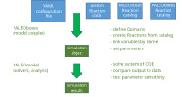

# Summary

[PALEOtoolkit](https://github.com/PALEOtoolkit) is a library to simulate and analyze the biogeochemical cycling of elements through the atmosphere, ocean and surface sedimentary reservoirs of rocky terrestrial planets, including the interaction between the biosphere and abiotic components.
It is written in a modular way, enabling the interactive use of individual model components, or combining simpler process models to create a more comprehensive (exo)Earth system coupled model. A catalog of components are available as Julia packages or wrapped Fortran libraries; these can be easily extended or combined with new components. PALEOtoolkit includes components and configurations used for understanding biogeochemical cycling over Earth history [@bergman_copse_2004; @lenton_copse_2018; @daines_excitable_2024], ocean and sediment biogeochemistry [@clarkson_ocean_2015], atmospheric photochemistry [@eager-nash_simulating_2024; @daines_effect_2016]. An introductory set of tutorials are available in the PALEOtutorials github repository.

# Statement of need

The composition of the atmosphere, ocean, and sediments of a rocky planet such as the Earth are controlled by a combination of abiotic processes (including tectonic inputs, atmospheric chemistry, and atmospheric escape) and biology (including production and decomposition of organic matter, and biotic influence of weathering and burial processes). Numerical simulation of these processes is an essential tool to test hypotheses for the processes involved and the controls on their rates against the geochemical record for Earth and the spectral signature of atmospheric composition for exoplanets. To cover the large range of timescales and processes involved, the majority of scientific questions in (exo)Earth system biogeochemistry require a hierarchy of models, from minimal conceptual models to more detailed process-based models that require efficient numerical tools [@steefel_reactive_2005].  Many these require the same base code e.g., for representing chemical reactions, isotope systems, and tracer transport as well as for numerical integration and output visualisation.   Most biogeochemical models have either focussed on detailed representation of specific components or processes (such as sediment biogeochemistry, the marine ecosystem, or atmospheric photochemistry), or provided highly parameterised low or zero-dimensional models for long timescales (such as the COPSE [@bergman_copse_2004; @lenton_copse_2018] and GEOCARB family of models), or provided monolithic coupled models (such as GENIE or CMIP Earth system models) that are restricted to small time intervals. More recent approaches have demonstrated the potential value of componentisation for flexibility and rapid development, including the ReacTran package in R [@soetaert_reactive_2012] for building models of reactive transport in aquatic ecosystems, the FABM model coupler for marine ecosystem models [@bruggeman_general_2014], and VPLanet for (exo)planet simulation [@barnes_vplanet_2020].

PALEOtoolkit provides a componentized framework that supports collaborative development of a hierachy of model configurations. This will enable an integrated understanding of Earth system ecology and biogeochemistry that exploits timescale separation in the Earth system to combines local process and data constraints with long timescale dynamics [@godderis_role_2014], and a framework to predict and eventually test hypotheses for exoplanet biosignatures [@catling_exoplanet_2018].

# Interface, design and implementation

{width=12cm}

The user interface to PALEOtoolkit is library based (\autoref{fig:compworkflow}), similar to the succesful paradigm established by eg the ReacTran package in R [@soetaert_reactive_2012], the Python-based climate model CLIMLAB [@rose_climlab_2018] and the Julia ocean model Oceaninanigans.jl [@ramadhan_oceananigansjl_2020]. The PALEOtoolkit infrastructure is provided by the PALEOboxes and PALEOmodel Julia packages and defines three 'views' on the model simulation and results (\autoref{fig:threeviews}) that provide appropriate abstractions enabling reuse of components and interoperability with other tools: (i) a 'model' view that abstracts biogeochemical processes into operations on named biogeochemical reservoirs and fluxes, and spatial structure into a set of grid cells arranged in vertical columns with upper and lower boundaries; (ii) a 'solver' view that collects state variables, time derivatives, and algebraic constraints into linear vectors, and Jacobians into sparse matrices; and (iii) an 'analysis' view that organises simulation results into data cubes approximately following the netCDF Common Data Model [@unidata_common_data_model].

{width=12cm}

All PALEOtoolkit model components ("Reactions") implement the PALEOreaction interface, which provides a standard template to define parameters, variables, Domain grids, and one or more methods that may implement a biogeochemical transformation, a transport process, or calculate a useful diagnostic. A model configuration is defined by a YAML configuration file, which specifies the model structure as a set of Domains (\autoref{fig:domains}) together with the Reactions (model components) to include in each Domain. Spatial structure within Domains and connectivity between Domains is defined by per-Domain grid objects.  A model coupler provided by the PALEOboxes Julia package collects and links model components into a simulation object. Variables are "linked" by name, where defaults provided by the Reaction implementation can be overridden in the YAML file. Dependency information (specified by labelling variables as Property/Dependency or Target/Contributor) is used to create a directed acyclic graph to sequence the execution of reaction methods within each model timestep. Naming conventions are used to define standard Domain configurations, and to identify standard variables eg providing spatial grid information including cell areas and volumes and environmental parameters such as light and temperature. Variable attributes are used to label related groups of variables such as tracer concentrations (to which advective transport should be applied), or state variables (which should be aggregated into a model state vector). The resulting system of ODE or DAE may then be simulated and analyzed interactively using the PALEOmodel.jl package, which provides full access to prognostic and diagnostic variables in the simulation object and accumulates results into an output dataset.

![Illustrative Domain (black and green outlines) and biogeochemical reservoir (blue circles) configurations for two PALEO model configurations: (**A**) a 0D coupled Earth system model; and (**B**) a standalone spatially resolved (1D) ocean column model. Green outlines represent Domains used to accumulate fluxes and couple model components. In the spatially-resolved configuration (B), connectivity between the ocean Domain and the oceansurface and oceanfloor boundaries is defined by subdomains ocean.oceansurface and ocean.oceanfloor which identify the subsets of ocean cells adjacent to the boundaries. Red and black arrows indicate tracer transport by eddy diffusive mixing (red arrows) and particulate sinking (black arrow), provided by PALEO Reactions\label{fig:domains}](domains_composite_fontpath.svg){width=12cm}

PALEOtoolkit leverages the Julia programming language and package ecosystem to provide computationally efficient high-level abstractions and interoperability with Julia and other software ecosystems. Staged compilation is used to generate optimized code for each model configuration that runs at comparable speed to a Fortran or C implementation, with minimal overhead (comparable to that of a C function call) due to component coupling. This allows model components to represent arbitrary levels of abstraction without loss of computational efficiency, from low level eg individual chemical reactions in a reaction network (\autoref{fig:examples}C), to high-level eg a Julia interface to the SOCRATES Fortran radiative transfer library (\autoref{fig:examples}D).  The PALEO simulation object is differentiable with respect to both state variables and model parameters using the ForwardDiff.jl Julia package [@revels_forward-mode_2016], with automatic generation of sparse Jacobians. This enables efficient and fully-implicit time-dependent or steady-state solutions, with differentiability with respect to parameters and adjoint sensitivity analysis [@rackauckas_universal_2021] enabling efficient Hamiltonian Markov-Chain Monte-Carlo methods [@xu2020advancedhmc] for Bayesian analysis and inverse modelling. Larger models (eg (\autoref{fig:examples}E)) can employ Julia's native multithreading support to make efficient use of multicore processors. Standard interfaces are provided to interoperate with packages across the Julia ecosystem, including numerical solvers from the SciML organization [@rackauckas_differentialequationsjl_2017] and the SUNDIALS library [@hindmarsh2005sundials], Bayesian parameter estimation and inverse modelling [@ge2018t], and visualization [@breloff_plotsjl_2024; @danisch_makiejl_2021]. To facilitate interoperability with other tools such as Xarray [@hoyer_xarray_2017], output from the simulation object may be saved and loaded as netcdf-format files.

# Examples

The Julia package system and public registry is used to provide a catalog of "standard" model components, immediately available as registered Julia packages (see \autoref{table:packages}). New scientific models can be created on a local PC or laptop, and optionally managed as a public or private github repository; these can combine existing model components and newly developed code.  Newly developed code can optionally be organized as a private or public Julia package to facilitate reuse.  

Examples of published or illustrative model configurations are available in github repositories (\autoref{table:packages}), including introductory examples and workshop materials in the `PALEOtutorials` repository.

| Julia package  | Github repository | Description | Example publications   |
|----------------|-------------------|-------------|---------------------------|
|                | [PALEOtutorials](https://github.com/PALEOtoolkit/PALEOtutorials.jl) | introductory tutorials | | 
|                | [EPOC_model](https://github.com/PALEOtoolkit/EPOC_model)  | EPOC phosphorus-oxygen-carbon biogeochemical model | [@daines_excitable_2024] |
| PALEOcopse     | [PALEOcopse.jl](https://github.com/PALEOtoolkit/PALEOcopse.jl)  | COPSE Earth system biogeochemical model | [@bergman_copse_2004; @lenton_copse_2018] |
| PALEOatmosphere | PALEOatmosphere.jl | atmospheric photochemistry and climate | [@daines_effect_2016; @eager-nash_simulating_2024] |
| SOCRATES       | SOCRATES.jl   | Julia wrapper for the SOCRATES radiative transport code | |
| PALEOocean     | PALEOocean.jl  | ocean biogeochemistry | [@clarkson_ocean_2015; @lenton_biogeochemical_2017] |
| PALEOaqchem    | PALEOaqchem.jl | aqueous biogeochemistry | | 
| PALEOsediment  | PALEOsediment.jl | sediment reaction-transport | |
| PALEOboxes     | PALEOboxes.jl  | model coupler | |
| PALEOmodel     | PALEOmodel.jl  | numerical solvers and analysis | |

: Currently available PALEOtoolkit github repositories and Julia packages \label{table:packages}

![Examples of PALEO model configurations: (**A**) Phanerozoic atmospheric pO2 compared to charcoal constraints from [@glasspool_phanerozoic_2010] (PALEOcopse,jl, COPSE reloaded model); (**B**) phase plane view of Neoproterozoic coupled oxygen (O), carbon (A), phosphorus (P) limit cycle oscillations with P nullcline surface and intersection with O, A nullclines (EPOC_model); (**C**) Archean 1D atmospheric photochemistry model (PALEOatmosphere.jl); (**D**) 1D radiative-convective model for the modern Earth atmosphere compared to data compilation from [@jain_radiative_2000] (PALEOatmosphere.jl, using SOCRATES radiative transfer library) (**E**) surface P concentration from a biogeochemistry model using offline transport matrix from the MITgcm at 2.8 degree resolution [@khatiwala_computational_2007] (PALEOocean.jl); (**F**) time series of P concentration for a 1D column biogeochemical model of a region of the North European shelf (PALEOocean.jl) \label{fig:examples}](examples_composite.svg)

# Acknowledgements

We acknowledge contributions from ... TODO

# References